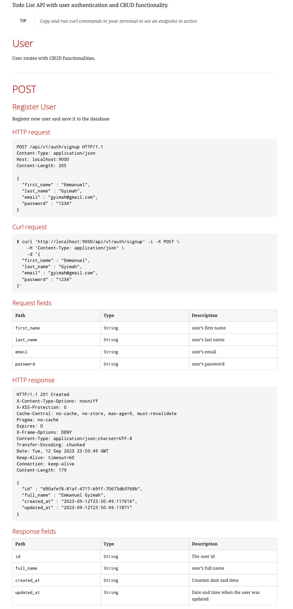
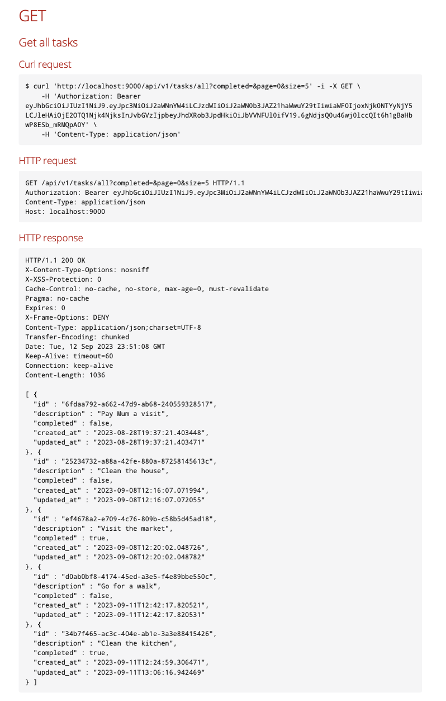

# todoapi
Simple todo restAPI with CRUD operations created with Java and SpringBoot

## Table of contents
* [General info](#general-info)
* [Technologies](#technologies)
* [Features](#features)
* [Illustrations](#illustrations)

## General info
This project is a todo API written in Java with Springboot. This project has Authentication, Database connectivity, Testing, Documentation and Containerization. 
I built this project as part of my learning process to learn new things as I want to advance in my career path. In this project, I learnt how to add <strong>Authentication, Test and Document</strong> an API.
	
## Technologies
Project was created with:
* Java
* SpringBoot
* Docker

## Features
The todo api has features like:
* Authenticating a user
* creating, updating and deleting a task
* adding a user profile image to user's profile

## Illustrations

